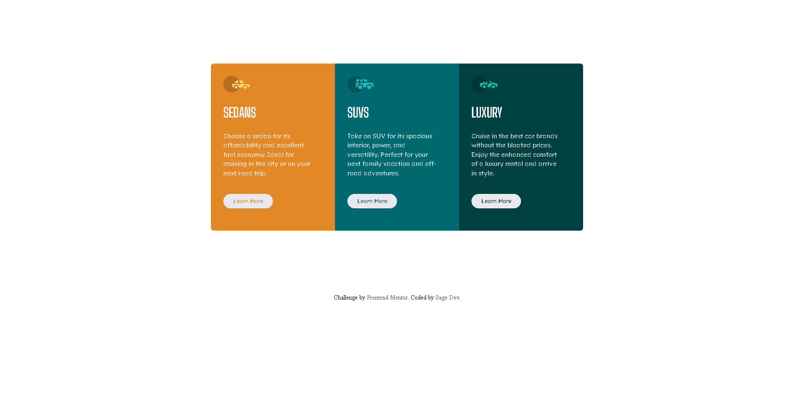

# Frontend Mentor - 3-column preview card component solution

This is a solution to the [3-column preview card component challenge on Frontend Mentor](https://www.frontendmentor.io/challenges/3column-preview-card-component-pH92eAR2-). 

## Table of contents

- [Overview](#overview)
  - [The challenge](#the-challenge)
  - [Screenshot](#screenshot)
  - [Links](#links)
- [My process](#my-process)
  - [Built with](#built-with)
  - [What I learned](#what-i-learned)
  - [Continued development](#continued-development)
  - [Useful resources](#useful-resources)
- [Author](#author)
- [Acknowledgments](#acknowledgments)

## Overview
I opted for this challenge because i want to learn more about the grid system. Though not complex, it helped a lot, understanding how to use the grid template area for resposive desing
### The challenge

Users should be able to:

- View the optimal layout depending on their device's screen size
- See hover states for interactive elements

### Screenshot

### Links

- Live Site URL: [Add live site URL here](https://component-card-review.netlify.app/)

## My process

### Built with

- Semantic HTML5 markup
- CSS custom properties
- CSS Grid
- Mobile-first workflow

### What I learned

This project allowed me to understand and implement the grid system in css. It was really amazing building this project.

### Continued development

In the course of becoming a better developer, i will continue to learn more about grid system and improve my responsive design skills as well to get a very goog paying tech job.

### Useful resources

- [Web.dev ](https://web.dev/learn/css/grid?continue=https%3A%2F%2Fweb.dev%2Flearn%2Fcss%23article-https%3A%2F%2Fweb.dev%2Flearn%2Fcss%2Fgrid) - This helped me alot to understand the grid system. Its very easy to understand here.

## Author

- Frontend Mentor - [@Jerryhugo](https://www.frontendmentor.io/profile/Jerryhugo)
- Twitter - [Sage.dev](https://twitter.com/insp_family)

